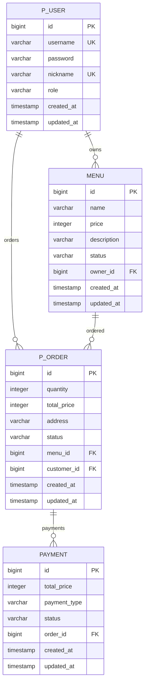
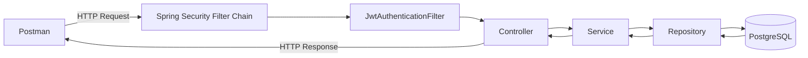

# 🍱 Delivery Order API

Spring Boot 기반의 간단한 배달 주문 서비스 백엔드 프로젝트입니다.

사장님(`OWNER`)은 메뉴를 등록하고 주문을 처리할 수 있으며,  
손님(`CUSTOMER`)은 메뉴를 조회하고 주문·결제를 진행할 수 있습니다.

프론트엔드는 구현하지 않았으며 Postman을 이용해 API를 테스트했습니다.

---

## 1. 프로젝트 개요

### 주요 기능

#### 👤 회원
- 회원가입
- 로그인
- BCrypt 비밀번호 암호화
- JWT Access Token 기반 인증
- `CUSTOMER`, `OWNER` 역할 기반 접근 제어

#### 🍜 메뉴
- 메뉴 등록
- 메뉴 목록 조회
- 메뉴 단건 조회
- 메뉴 수정
- 메뉴 Soft Delete
- OWNER 본인의 메뉴만 수정 및 삭제 가능

#### 🧾 주문
- 주문 생성
- 역할별 주문 목록 조회
- CUSTOMER 본인 주문 취소
- OWNER 주문 수락 및 배달 완료 처리
- 주문 상태 전이 검증

#### 💳 결제
- CUSTOMER 본인 주문 결제
- 카드 결제만 허용
- 주문 총액을 이용한 서버 측 결제 금액 결정
- 중복 결제 방지
- 결제 완료 시 주문 상태 자동 변경

---

## 2. 기술 스택

| 구분 | 기술 |
| --- | --- |
| Language | Java 21 |
| Framework | Spring Boot 4.1.x |
| Web | Spring MVC |
| ORM | Spring Data JPA / Hibernate |
| Database | PostgreSQL |
| Security | Spring Security |
| Authentication | JWT (JJWT) |
| Validation | Jakarta Validation |
| Build Tool | Gradle |
| Test Tool | Postman |
| ETC | Lombok |

---

## 3. 주요 설계

### 인증 / 인가

로그인 성공 시 JWT Access Token을 발급합니다.

이후 인증이 필요한 API는 다음 Header를 사용합니다.

```http
Authorization: Bearer {accessToken}
```

요청이 들어오면 JWT Filter에서 토큰을 검증한 후 인증 정보를 `SecurityContext`에 저장합니다.

```text
Client
  ↓
Authorization Header
  ↓
JwtAuthenticationFilter
  ↓
JWT 검증
  ↓
Authentication 생성
  ↓
SecurityContext 저장
  ↓
Controller
  ↓
@AuthenticationPrincipal
```

역할에 따른 API 접근은 Spring Security와 `@PreAuthorize`를 사용하며,  
본인의 메뉴나 주문인지 확인하는 소유권 검증은 Service 계층에서 처리합니다.

---

### 주문 상태 흐름

주문 상태는 정해진 순서로만 변경할 수 있습니다.

```text
ORDERED
   │
   ├──── CUSTOMER 주문 취소 ────→ CANCELED
   │
   └──── CUSTOMER 결제 ─────────→ PAID
                                      │
                                      └──── OWNER 주문 수락 ───→ ACCEPTED
                                                                    │
                                                                    └──── OWNER 배달 완료 ───→ COMPLETED
```

허용되지 않은 상태 변경은 예외 처리합니다.

예를 들어 다음과 같은 변경은 불가능합니다.

```text
ORDERED → COMPLETED
PAID → CANCELED
COMPLETED → ACCEPTED
PAID → PAID
```

---

# 4. ERD

## 4-1. ERD

총 4개의 핵심 엔티티를 사용했습니다.

- `p_user`
- `menu`
- `p_order`
- `payment`

필수 연관관계는 모두 `N:1` 관계이며 JPA에서 `FetchType.LAZY`를 사용했습니다.



### 연관관계

```text
User(OWNER)    1 : N Menu
User(CUSTOMER) 1 : N Order
Menu           1 : N Order
Order          1 : N Payment
```

- `menu.owner_id` → `p_user.id`
- `p_order.customer_id` → `p_user.id`
- `p_order.menu_id` → `menu.id`
- `payment.order_id` → `p_order.id`

### dbdiagram.io DBML

```dbml
Table p_user {
  id bigint [pk, increment]
  username varchar [not null, unique]
  password varchar [not null]
  nickname varchar [not null, unique]
  role varchar [not null]
  created_at timestamp [not null]
  updated_at timestamp [not null]
}

Table menu {
  id bigint [pk, increment]
  name varchar [not null]
  price integer [not null]
  description varchar
  status varchar [not null]
  owner_id bigint [not null]
  created_at timestamp [not null]
  updated_at timestamp [not null]
}

Table p_order {
  id bigint [pk, increment]
  quantity integer [not null]
  total_price integer [not null]
  address varchar [not null]
  status varchar [not null]
  menu_id bigint [not null]
  customer_id bigint [not null]
  created_at timestamp [not null]
  updated_at timestamp [not null]
}

Table payment {
  id bigint [pk, increment]
  total_price integer [not null]
  payment_type varchar [not null]
  status varchar [not null]
  order_id bigint [not null]
  created_at timestamp [not null]
  updated_at timestamp [not null]
}

Ref: menu.owner_id > p_user.id
Ref: p_order.customer_id > p_user.id
Ref: p_order.menu_id > menu.id
Ref: payment.order_id > p_order.id
```

---

# 5. 테이블 명세서

## 5-1. 회원 `p_user`

| 컬럼 | 타입 | 제약 | 설명 |
| --- | --- | --- | --- |
| `id` | BIGINT | PK, AUTO INCREMENT | 회원 식별자 |
| `username` | VARCHAR | UNIQUE, NOT NULL | 로그인 아이디 |
| `password` | VARCHAR | NOT NULL | BCrypt 암호화 비밀번호 |
| `nickname` | VARCHAR | UNIQUE, NOT NULL | 닉네임 |
| `role` | VARCHAR | NOT NULL | `CUSTOMER`, `OWNER` |
| `created_at` | TIMESTAMP | NOT NULL | 생성 시각 |
| `updated_at` | TIMESTAMP | NOT NULL | 수정 시각 |

---

## 5-2. 메뉴 `menu`

| 컬럼 | 타입 | 제약 | 설명 |
| --- | --- | --- | --- |
| `id` | BIGINT | PK, AUTO INCREMENT | 메뉴 식별자 |
| `name` | VARCHAR | NOT NULL | 메뉴 이름 |
| `price` | INTEGER | NOT NULL | 메뉴 가격 |
| `description` | VARCHAR | NULL 허용 | 메뉴 설명 |
| `status` | VARCHAR | NOT NULL | 메뉴 상태 |
| `owner_id` | BIGINT | FK → `p_user(id)`, NOT NULL | 메뉴를 등록한 OWNER |
| `created_at` | TIMESTAMP | NOT NULL | 생성 시각 |
| `updated_at` | TIMESTAMP | NOT NULL | 수정 시각 |

메뉴 삭제는 실제 데이터를 제거하지 않고 상태를 변경하는 Soft Delete 방식으로 구현했습니다.

---

## 5-3. 주문 `p_order`

| 컬럼 | 타입 | 제약 | 설명 |
| --- | --- | --- | --- |
| `id` | BIGINT | PK, AUTO INCREMENT | 주문 식별자 |
| `quantity` | INTEGER | NOT NULL | 주문 수량 |
| `total_price` | INTEGER | NOT NULL | 주문 총액 |
| `address` | VARCHAR | NOT NULL | 배송 주소 |
| `status` | VARCHAR | NOT NULL | 주문 상태 |
| `menu_id` | BIGINT | FK → `menu(id)`, NOT NULL | 주문 메뉴 |
| `customer_id` | BIGINT | FK → `p_user(id)`, NOT NULL | 주문한 CUSTOMER |
| `created_at` | TIMESTAMP | NOT NULL | 생성 시각 |
| `updated_at` | TIMESTAMP | NOT NULL | 수정 시각 |

주문 총액은 클라이언트에서 전달받지 않고 서버에서 계산합니다.

```text
totalPrice = menu.price × quantity
```

---

## 5-4. 결제 `payment`

| 컬럼 | 타입 | 제약 | 설명 |
| --- | --- | --- | --- |
| `id` | BIGINT | PK, AUTO INCREMENT | 결제 식별자 |
| `total_price` | INTEGER | NOT NULL | 결제 금액 |
| `payment_type` | VARCHAR | NOT NULL | 결제 방식 |
| `status` | VARCHAR | NOT NULL | 결제 상태 |
| `order_id` | BIGINT | FK → `p_order(id)`, NOT NULL | 결제 대상 주문 |
| `created_at` | TIMESTAMP | NOT NULL | 생성 시각 |
| `updated_at` | TIMESTAMP | NOT NULL | 수정 시각 |

결제 금액 역시 Request에서 전달받지 않습니다.

주문에 저장된 총액을 사용합니다.

```java
order.getTotalPrice();
```

---

# 6. API 명세서

## 6-1. 회원 API

### 회원가입

| 항목 | 내용 |
| --- | --- |
| 기능 | 회원가입 |
| Method | `POST` |
| URL | `/api/auth/signup` |
| 권한 | 누구나 |
| 성공 | `201 Created` |
| 실패 | `400`, `409` |

#### Request

```json
{
  "username": "cust1",
  "password": "password123",
  "nickname": "고객1",
  "role": "CUSTOMER"
}
```

#### Response

```json
{
  "id": 1,
  "username": "cust1",
  "nickname": "고객1",
  "role": "CUSTOMER"
}
```

---

### 로그인

| 항목 | 내용 |
| --- | --- |
| 기능 | 로그인 |
| Method | `POST` |
| URL | `/api/auth/login` |
| 권한 | 누구나 |
| 성공 | `200 OK` |
| 실패 | `401 Unauthorized` |

#### Request

```json
{
  "username": "cust1",
  "password": "password123"
}
```

#### Response

```json
{
  "accessToken": "{JWT_ACCESS_TOKEN}"
}
```

---

# 6-2. 메뉴 API

## 메뉴 등록

| 항목 | 내용 |
| --- | --- |
| Method | `POST` |
| URL | `/api/menus` |
| 권한 | OWNER |
| 성공 | `201 Created` |
| 실패 | `400`, `403` |

```json
{
  "name": "김밥",
  "price": 3500,
  "description": "기본 김밥"
}
```

---

## 메뉴 목록 조회

| 항목 | 내용 |
| --- | --- |
| Method | `GET` |
| URL | `/api/menus` |
| 권한 | 누구나 |
| 성공 | `200 OK` |

Soft Delete된 메뉴는 조회 결과에서 제외합니다.

---

## 메뉴 단건 조회

| 항목 | 내용 |
| --- | --- |
| Method | `GET` |
| URL | `/api/menus/{menuId}` |
| 권한 | 누구나 |
| 성공 | `200 OK` |
| 실패 | `404 Not Found` |

---

## 메뉴 수정

| 항목 | 내용 |
| --- | --- |
| Method | `PATCH` |
| URL | `/api/menus/{menuId}` |
| 권한 | OWNER / 본인 메뉴 |
| 성공 | `200 OK` |
| 실패 | `400`, `403`, `404` |

```json
{
  "name": "참치김밥",
  "price": 4500,
  "description": "참치가 들어간 김밥"
}
```

---

## 메뉴 삭제

| 항목 | 내용 |
| --- | --- |
| Method | `DELETE` |
| URL | `/api/menus/{menuId}` |
| 권한 | OWNER / 본인 메뉴 |
| 성공 | `200 OK` 또는 `204 No Content` |
| 실패 | `403`, `404` |

실제 DB Row를 삭제하지 않고 Soft Delete 처리합니다.

---

# 6-3. 주문 API

## 주문 생성

| 항목 | 내용 |
| --- | --- |
| Method | `POST` |
| URL | `/api/orders` |
| 권한 | CUSTOMER |
| 성공 | `201 Created` |
| 실패 | `400`, `403`, `404` |

#### Request

```json
{
  "menuId": 1,
  "quantity": 2,
  "address": "서울특별시 강남구"
}
```

#### Response 예시

```json
{
  "id": 1,
  "menuId": 1,
  "menuName": "김밥",
  "quantity": 2,
  "totalPrice": 7000,
  "address": "서울특별시 강남구",
  "status": "ORDERED"
}
```

주문 금액은 서버에서 계산합니다.

```text
3,500 × 2 = 7,000원
```

---

## 주문 목록 조회

| 항목 | 내용 |
| --- | --- |
| Method | `GET` |
| URL | `/api/orders` |
| 권한 | 로그인 사용자 |
| 성공 | `200 OK` |

역할에 따라 조회되는 주문이 달라집니다.

### CUSTOMER

```text
본인이 생성한 주문만 조회
```

### OWNER

```text
본인이 등록한 메뉴에 들어온 주문만 조회
```

---

## 주문 취소

| 항목 | 내용 |
| --- | --- |
| Method | `PATCH` |
| URL | `/api/orders/{orderId}/cancel` |
| 권한 | CUSTOMER / 본인 주문 |
| 성공 | `200 OK` 또는 `204 No Content` |
| 실패 | `403`, `404`, `409` |

`ORDERED` 상태에서만 취소할 수 있습니다.

```text
ORDERED → CANCELED
```

결제가 완료된 주문은 취소할 수 없습니다.

---

## 주문 상태 변경

| 항목 | 내용 |
| --- | --- |
| Method | `PATCH` |
| URL | `/api/orders/{orderId}/status` |
| 권한 | OWNER / 본인 메뉴의 주문 |
| 성공 | `200 OK` 또는 `204 No Content` |
| 실패 | `403`, `404`, `409` |

#### 주문 수락

```json
{
  "status": "ACCEPTED"
}
```

```text
PAID → ACCEPTED
```

#### 배달 완료

```json
{
  "status": "COMPLETED"
}
```

```text
ACCEPTED → COMPLETED
```

---

# 6-4. 결제 API

## 결제

| 항목 | 내용 |
| --- | --- |
| Method | `POST` |
| URL | `/api/orders/{orderId}/payments` |
| 권한 | CUSTOMER / 본인 주문 |
| 성공 | `201 Created` |
| 실패 | `400`, `403`, `404`, `409` |

#### Request

```json
{
  "paymentType": "CARD"
}
```

결제 금액은 Request에서 받지 않습니다.

```text
Client
  ↓
orderId 전달
  ↓
Server에서 Order 조회
  ↓
order.totalPrice 사용
  ↓
Payment 저장
```

#### Response 예시

```json
{
  "id": 1,
  "orderId": 1,
  "totalPrice": 7000,
  "paymentType": "CARD",
  "status": "COMPLETED"
}
```

결제 성공 시 주문 상태도 함께 변경됩니다.

```text
ORDERED → PAID
```

---

# 7. HTTP 상태 코드

| 상태 코드 | 의미 | 사용 예시 |
| --- | --- | --- |
| `200 OK` | 요청 성공 | 조회, 수정 |
| `201 Created` | 생성 성공 | 회원가입, 메뉴 등록, 주문, 결제 |
| `204 No Content` | 성공, 응답 Body 없음 | 삭제 또는 상태 변경 |
| `400 Bad Request` | 잘못된 요청 | Validation 실패, 잘못된 결제 수단 |
| `401 Unauthorized` | 인증 실패 | 로그인 실패 |
| `403 Forbidden` | 접근 권한 없음 | 다른 사용자의 주문/메뉴 접근 |
| `404 Not Found` | 리소스 없음 | 없는 메뉴, 없는 주문 |
| `409 Conflict` | 현재 상태와 충돌 | 중복 회원가입, 잘못된 주문 상태 변경 |

---

# 8. 예외 처리

`@RestControllerAdvice`를 사용해 애플리케이션 예외를 공통 처리했습니다.

응답 형식은 다음과 같이 통일했습니다.

```json
{
  "message": "본인의 주문만 취소할 수 있습니다."
}
```

주요 예외 상황:

```text
Validation 실패          → 400
로그인 실패              → 401
다른 사용자의 데이터 접근 → 403
존재하지 않는 리소스      → 404
중복 / 상태 충돌          → 409
```

---

# 9. 인프라 설계

본 프로젝트는 별도의 배포 없이 로컬 환경에서 실행합니다.



전체 요청 흐름은 다음과 같습니다.

```text
Postman
   ↓
Spring Security Filter Chain
   ↓
JWT Authentication Filter
   ↓
Controller
   ↓
Service
   ↓
Repository
   ↓
PostgreSQL
```

JWT 인증이 필요한 요청은 Controller에 진입하기 전에 Filter에서 토큰을 검증합니다.

---

# 10. 프로젝트 구조

```text
src/main/java/com/sparta/delivery
│
├── global
│   ├── config
│   │   └── SecurityConfig
│   │
│   ├── security
│   │   ├── AuthUser
│   │   ├── JwtUtil
│   │   └── JwtAuthenticationFilter
│   │
│   ├── entity
│   │   └── BaseEntity
│   │
│   └── exception
│       └── GlobalExceptionHandler
│
├── domain
│   ├── user
│   │   ├── controller
│   │   ├── service
│   │   ├── repository
│   │   ├── entity
│   │   └── dto
│   │
│   ├── menu
│   │   ├── controller
│   │   ├── service
│   │   ├── repository
│   │   ├── entity
│   │   └── dto
│   │
│   ├── order
│   │   ├── controller
│   │   ├── service
│   │   ├── repository
│   │   ├── entity
│   │   └── dto
│   │
│   └── payment
│       ├── controller
│       ├── service
│       ├── repository
│       ├── entity
│       └── dto
│
└── DeliveryApplication
```

---

# 11. 환경 변수

DB 비밀번호와 JWT Secret Key는 GitHub Repository에 직접 저장하지 않고 환경변수로 관리합니다.

예시:

```yaml
spring:
  datasource:
    url: ${DB_URL:jdbc:postgresql://localhost:5432/delivery}
    username: ${DB_USERNAME:delivery}
    password: ${DB_PASSWORD}

jwt:
  secret:
    key: ${JWT_SECRET_KEY}
```

필요한 환경 변수:

```text
DB_PASSWORD
JWT_SECRET_KEY
```

JWT Secret Key는 HS256 사용을 위해 256bit 이상의 Key를 사용합니다.

---

# 12. JPA 설정

모든 엔티티는 `BaseEntity`를 상속하며 JPA Auditing을 사용해 생성·수정 시각을 자동으로 관리합니다.

```text
createdAt
updatedAt
```

연관관계는 모두 지연 로딩을 사용합니다.

```java
@ManyToOne(fetch = FetchType.LAZY)
```

enum 값은 숫자가 아닌 문자열로 저장합니다.

```java
@Enumerated(EnumType.STRING)
```

---

# 13. Postman 테스트

다음과 같은 시나리오를 기준으로 전체 API를 테스트했습니다.

### 인증

- OWNER 2명 회원가입
- CUSTOMER 2명 회원가입
- 중복 회원가입 차단
- Validation 검증
- 로그인 및 JWT 발급
- 잘못된 로그인 차단

### 메뉴

- CUSTOMER 메뉴 생성 차단
- OWNER 메뉴 생성
- 메뉴 목록 / 단건 조회
- 다른 OWNER의 메뉴 수정 차단
- 본인 메뉴 수정
- Soft Delete 확인

### 주문

- OWNER 주문 생성 차단
- CUSTOMER 주문 생성
- 잘못된 수량 Validation
- CUSTOMER 본인 주문 목록 조회
- OWNER 본인 메뉴 주문 목록 조회
- 결제 전 주문 수락 차단
- 다른 CUSTOMER의 주문 취소 차단
- 결제 완료 주문 취소 차단
- 다른 OWNER의 주문 상태 변경 차단

### 결제

- 다른 CUSTOMER의 주문 결제 차단
- 카드 결제 성공
- 서버 측 결제 금액 결정
- 중복 결제 차단
- 취소된 주문 결제 차단

### 주문 처리

```text
ORDERED
→ PAID
→ ACCEPTED
→ COMPLETED
```

순서대로 상태가 변경되는 것을 확인했습니다.

---

# 14. 주요 구현 포인트

### 서버에서 주문 금액 계산

클라이언트에서 주문 금액을 직접 전달받지 않습니다.

```text
menu.price × quantity
```

를 서버에서 계산해 주문 생성 시 저장합니다.

---

### 결제 금액 서버 관리

결제 시에도 클라이언트가 금액을 보내지 않습니다.

주문 생성 시 확정된:

```java
order.getTotalPrice()
```

값을 Payment에 저장합니다.

따라서 클라이언트가 임의로 결제 금액을 조작할 수 없습니다.

---

### 메뉴 Soft Delete

주문에서 Menu를 FK로 참조하고 있으므로 기존 주문 데이터의 무결성을 유지하기 위해 메뉴를 실제로 삭제하지 않습니다.

메뉴 상태를 삭제 상태로 변경하고 이후 메뉴 조회 및 주문에서는 존재하지 않는 메뉴처럼 처리합니다.

---

### Entity에서 주문 상태 관리

주문 상태를 Service에서 임의로 변경하지 않고 `Order` Entity 내부 메서드에서 검증합니다.

```java
order.cancel();
order.pay();
order.accept();
order.complete();
```

이를 통해 허용되지 않은 상태 전이를 방지합니다.

---

### Stateless JWT 인증

JWT 인증 방식을 사용하고 서버 세션은 사용하지 않습니다.

```java
SessionCreationPolicy.STATELESS
```

각 요청마다 JWT Filter에서 토큰을 검증하고 `SecurityContext`에 인증 정보를 저장합니다.

---

# 15. 실행 방법

## PostgreSQL 실행

Docker를 사용하는 경우:

```bash
docker run \
  --name delivery-db \
  -e POSTGRES_USER=delivery \
  -e POSTGRES_PASSWORD={PASSWORD} \
  -e POSTGRES_DB=delivery \
  -p 5432:5432 \
  -d postgres:18
```

기존 컨테이너가 있다면:

```bash
docker start delivery-db
```

---

## 환경 변수 설정

```text
DB_PASSWORD={DB 비밀번호}
JWT_SECRET_KEY={JWT Secret Key}
```

---

## 애플리케이션 실행

```bash
./gradlew bootRun
```

또는 IntelliJ에서 `DeliveryApplication`을 실행합니다.

---

## API 테스트

Postman에서 로그인 후 발급된 Access Token을 인증이 필요한 요청에 전달합니다.

```http
Authorization: Bearer {accessToken}
```

---

# 16. ERD 관계 요약

```text
p_user
 ├──── 1:N ──── menu
 │                 │
 │                 └──── 1:N ──── p_order
 │
 └──── 1:N ────────────────────── p_order
                                      │
                                      └──── 1:N ──── payment
```

즉,

```text
OWNER    → 여러 Menu 등록 가능
CUSTOMER → 여러 Order 생성 가능
Menu     → 여러 Order가 들어올 수 있음
Order    → 여러 Payment 기록을 가질 수 있음
```

모든 연관관계의 외래키는 N 쪽 테이블에서 관리합니다.
