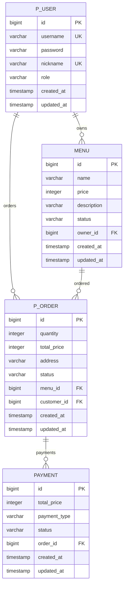
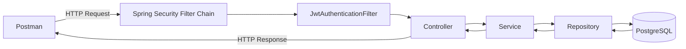

# Delivery Order API

Spring Boot 기반 배달 주문 서비스 백엔드 프로젝트입니다.

## 기술 스택

- Java 21
- Spring Boot 4.1.x
- Spring Data JPA
- Spring Security
- JWT
- PostgreSQL
- Gradle

## ERD

## 테이블 명세서

### p_user

| 컬럼 | 타입 | 제약 | 설명 |
| --- | --- | --- | --- |
| id | BIGINT | PK | 회원 ID |
| username | VARCHAR | UNIQUE, NOT NULL | 로그인 아이디 |
| password | VARCHAR | NOT NULL | BCrypt 비밀번호 |
| nickname | VARCHAR | UNIQUE, NOT NULL | 닉네임 |
| role | VARCHAR | NOT NULL | CUSTOMER / OWNER |
| created_at | TIMESTAMP | NOT NULL | 생성 시각 |
| updated_at | TIMESTAMP | NOT NULL | 수정 시각 |

### menu

| 컬럼 | 타입 | 제약 | 설명 |
| --- | --- | --- | --- |
| id | BIGINT | PK | 메뉴 ID |
| name | VARCHAR | NOT NULL | 메뉴 이름 |
| price | INTEGER | NOT NULL | 가격 |
| description | VARCHAR |  | 설명 |
| status | VARCHAR | NOT NULL | 메뉴 상태 |
| owner_id | BIGINT | FK, NOT NULL | 사장님 ID |
| created_at | TIMESTAMP | NOT NULL | 생성 시각 |
| updated_at | TIMESTAMP | NOT NULL | 수정 시각 |

### p_order

| 컬럼 | 타입 | 제약 | 설명 |
| --- | --- | --- | --- |
| id | BIGINT | PK | 주문 ID |
| quantity | INTEGER | NOT NULL | 수량 |
| total_price | INTEGER | NOT NULL | 주문 총액 |
| address | VARCHAR | NOT NULL | 배송 주소 |
| status | VARCHAR | NOT NULL | 주문 상태 |
| menu_id | BIGINT | FK, NOT NULL | 메뉴 ID |
| customer_id | BIGINT | FK, NOT NULL | 주문자 ID |
| created_at | TIMESTAMP | NOT NULL | 생성 시각 |
| updated_at | TIMESTAMP | NOT NULL | 수정 시각 |

### payment

| 컬럼 | 타입 | 제약 | 설명 |
| --- | --- | --- | --- |
| id | BIGINT | PK | 결제 ID |
| total_price | INTEGER | NOT NULL | 결제 금액 |
| payment_type | VARCHAR | NOT NULL | 결제 방식 |
| status | VARCHAR | NOT NULL | 결제 상태 |
| order_id | BIGINT | FK, NOT NULL | 주문 ID |
| created_at | TIMESTAMP | NOT NULL | 생성 시각 |
| updated_at | TIMESTAMP | NOT NULL | 수정 시각 |

## API 명세

| 기능 | Method | URL | 권한 |
| --- | --- | --- | --- |
| 회원가입 | POST | /api/auth/signup | 누구나 |
| 로그인 | POST | /api/auth/login | 누구나 |
| 메뉴 등록 | POST | /api/menus | OWNER |
| 메뉴 목록 조회 | GET | /api/menus | 누구나 |
| 메뉴 단건 조회 | GET | /api/menus/{menuId} | 누구나 |
| 메뉴 수정 | PATCH | /api/menus/{menuId} | OWNER |
| 메뉴 삭제 | DELETE | /api/menus/{menuId} | OWNER |
| 주문 생성 | POST | /api/orders | CUSTOMER |
| 주문 목록 조회 | GET | /api/orders | 로그인 사용자 |
| 주문 취소 | PATCH | /api/orders/{orderId}/cancel | CUSTOMER |
| 주문 상태 변경 | PATCH | /api/orders/{orderId}/status | OWNER |
| 결제 | POST | /api/orders/{orderId}/payments | CUSTOMER |

## 인프라 설계

